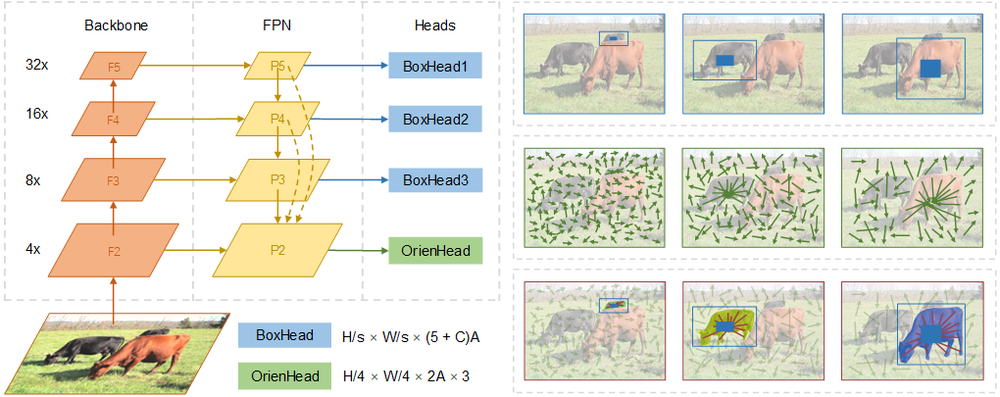

# OrienMask

This repository implements the framework OrienMask for real-time instance segmentation.

It achieves 34.8 mask AP on COCO test-dev at the speed of 42.7 FPS evaluated with a single RTX 2080Ti. ([log](assets/test-dev_scoring_output.log))

Paper: [Real-time Instance Segmentation with Discriminative Orientation Maps](https://arxiv.org/abs/2106.12204) (ICCV 2021)



## Installation

Please see [INSTALL.md](INSTALL.md) to prepare the environment and dataset.

## Usage

Place the pre-trained backbone ([link](https://drive.google.com/file/d/15D68yd1j6AsAMeXDrZs-R4_mWmE2x9tN/view?usp=sharing)) and trained model ([link](https://drive.google.com/file/d/1P4tLk0CUztLZ3juTVwUIiIBF0LbCjvJd/view?usp=sharing)) as follows for convenience (otherwise update the corresponding path in configurations):

```
├── checkpoints
│   ├── pretrained
│   │   ├──pretrained_darknet53.pth
│   ├── OrienMaskAnchor4FPNPlus
│   │   ├──orienmask_yolo.pth
```

### train

Three items should be noticed when deploying different number of GPUs: `n_gpu`, `batch_size`, `accumulate`. Keep in mind that the approximate batch size equals to `n_gpu` * `batch_size` * `accumulate`.

```bash
# multi-gpu train (n_gpu=2, batch_size=8, accumulate=1)
# if necessary, set MASTER_PORT to avoid port conflict
# if permission error, run `chmod +x dist_train.sh`
CUDA_VISIBLE_DEVICES=0,1 ./dist_train.sh \
    -c orienmask_yolo_coco_544_anchor4_fpn_plus

# single-gpu train (n_gpu=1, batch_size=8, accumulate=2)
CUDA_VISIBLE_DEVICES=0 ./dist_train.sh \
    -c orienmask_yolo_coco_544_anchor4_fpn_plus
# or
CUDA_VISIBLE_DEVICES=0 python train.py \
    -c orienmask_yolo_coco_544_anchor4_fpn_plus
```

### test

Run the following command to obtain AP and AR metrics on *val2017* split:

```bash
CUDA_VISIBLE_DEVICES=0 python test.py \
    -c orienmask_yolo_coco_544_anchor4_fpn_plus_test \
    -w checkpoints/OrienMaskAnchor4FPNPlus/orienmask_yolo.pth
```

### infer

Please run `python infer.py -h` for more usages.

```bash
# infer on an image and save the visualized result
CUDA_VISIBLE_DEVICES=0 python infer.py \
    -c orienmask_yolo_coco_544_anchor4_fpn_plus_infer \
    -w checkpoints/OrienMaskAnchor4FPNPlus/orienmask_yolo.pth \
    -i assets/000000163126.jpg -v -o outputs

# infer on a list of images and save the visualized results
CUDA_VISIBLE_DEVICES=0 python infer.py \
    -c orienmask_yolo_coco_544_anchor4_fpn_plus_infer \
    -w checkpoints/OrienMaskAnchor4FPNPlus/orienmask_yolo.pth \
    -d coco/test2017 -l assets/test_dev_selected.txt -v -o outputs
```

### logs

We provide two types of logs for monitoring the training process. The first is updated on the terminal which is also stored in a `train.log` file in the checkpoint directory. The other is the tensorboard whose statistics are kept in the checkpoint directory.

## Citation

```
@article{du2021realtime,
  title={Real-time Instance Segmentation with Discriminative Orientation Maps}, 
  author={Du, Wentao and Xiang, Zhiyu and Chen, Shuya and Qiao, Chengyu and Chen, Yiman and Bai, Tingming},
  journal={arXiv preprint arXiv:2106.12204},
  year={2021}
}
```